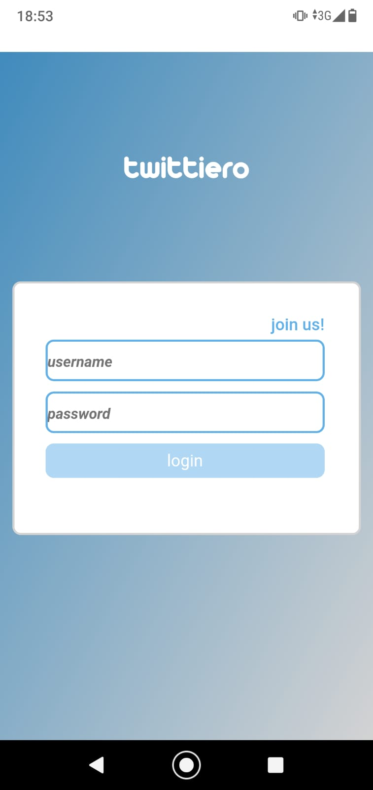

# Twittero app
[download apk](https://exp-shell-app-assets.s3.us-west-1.amazonaws.com/android/%40enekobi/twittiero-9927571980d44db990f8122f3f81f14b-signed.apk)

This project is a simple and experimental React Native app containing a WebView pointing to [Twittiero's web-app](https://twittiero.netlify.app/). 

It works as a simple approach to demonstrate how easily can be a web-app put as a "native" mobile app. Thanks to the [Expo](https://expo.io/) tool, can be developped and deployed following few simple commands. It holds the app builds (e.g the apk) for free for a month too, so you can serve your app from there also.

There are some differences, though. For example, the cookie management from the web-app does not work propperly on the mobile app. So future has to be made to make this a real world viable app.

